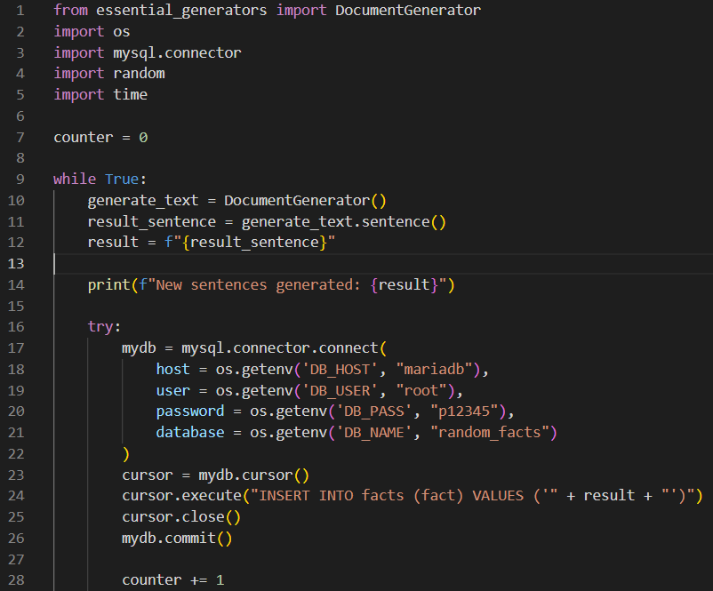

# https://app.zefirnikolov.com

This is only the **generator** part **microservice** of the whole** Kubernetes Cluster** deployed on **Amazon Web Services – AWS**. 
This part is intended for development team + **Dockerfile** and **Jenkinsfile** are intended for the **DevOps** -> Please see the whole cluster on **https://github.com/zefirnikolov/awsapp-k8scluster**

Code folder consists of 2 files -> app.py and requirements.txt. 

**requirements.txt** -> this file is created in support for the Dockerfile. It is describing which python libraries should be installed with the Python docker image. 

**app.py** -> This simple **Python** program:
 1. Imports the libraries needed for the program: essentials generator, mysql. connector, os, random, time
2. Creates a while loop in which a random text is generated ( using essentials generator library), then this generated text is sent to the MariaDB database:
Part of the code:

The **Dockerfile**:
Downloads the main **Docker image**: **python:3.9-slim-buster** -> installs software and makes update of the OS -> installs the python libraries in requirements.txt file -> opens and runs the app.py as the main process of the container.

The **Jenkinsfile**:
Clones the **git repository** -> creates a **docker image** from the **Dockerfile** -> Push the image with Updated TAG to **Docker Hub** -> triggers the **second Jenkins job responsible** for the cluster repository.

